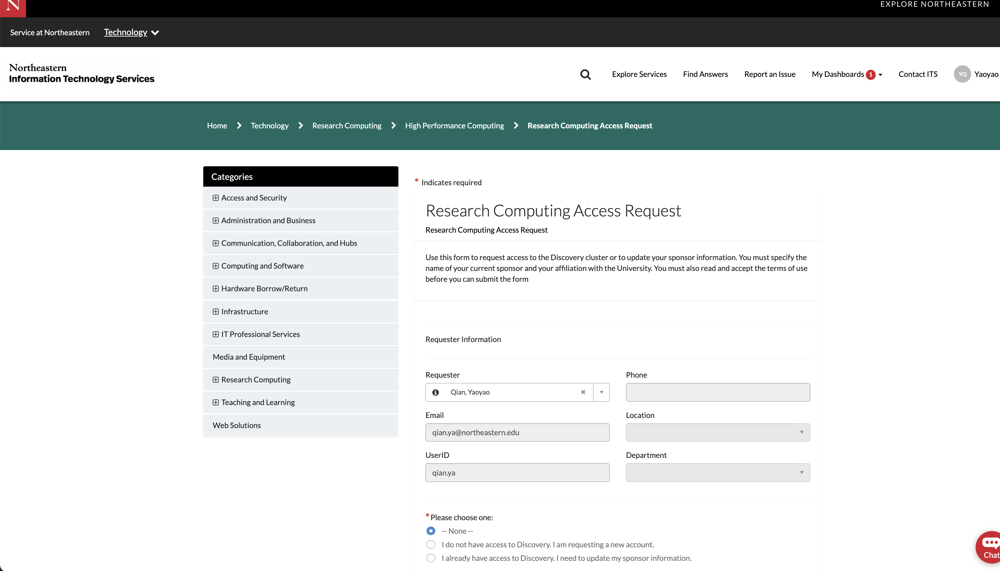
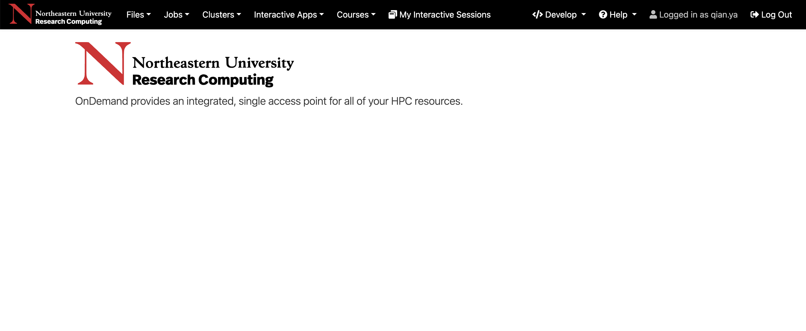

# NEU Discovery Cluster Tutorial

## Step 1: Request Access

Note: You must enter a university sponsor—contact your professor before requesting access! 😊

**All Discovery users need a sponsor to approve their request, typically a PI or professor. PIs, professors, and instructors can sponsor themselves by using their own name in the University Sponsor field.**

https://rc.northeastern.edu/getting-access/


Click the "Request Access to the Cluster" button



Complete the form. 

**After submitting the ServiceNow form, the system sends an approval email to your specified sponsor. The sponsor will receive reminders until they approve your request through the link in the email. It's recommended to notify your sponsor in advance to watch for this approval email.**

**Once your sponsor approves, account setup may take up to 24 hours to complete. You'll receive an email confirmation when access is granted. If you're new to Discovery, high-performance computing, or Linux, check out the [Discovery Training Page](https://rc.northeastern.edu/support/training/) (watching the training video will get you most of the way there!)**

For additional documentation, visit: https://rc-docs.northeastern.edu/en/latest/connectingtocluster/index.html

## Step 2 :After you have the access of the **Discovery**:

**If you already have a Discovery account, access OOD by following the steps below:**

**Enter [http://ood.discovery.neu.edu](http://ood.discovery.neu.edu/) in a web browserSelect Northeastern University from the drop menu and select continue,Next, you will enter your Northeastern credentials to login.You will be then be required to Duo authenticate. Once you’ve completed this step you will be taken to the OOD landing page and you can begin your work.**

- Enter [**http://ood.discovery.neu.edu**](http://ood.discovery.neu.edu/) in a web browser
- Select **Northeastern University** from the drop menu and select continue,
- Next, you will enter your Northeastern credentials to login.
- You will be then be required to Duo authenticate. Once you’ve completed this step you will be taken to the OOD landing page and you can begin your work.


For additional documentation, see: https://osc.github.io/ood-documentation/latest/ 

You can connect to the clusters either through the online shell (https://rc-docs.northeastern.edu/en/latest/connectingtocluster/index.html) or by following this tutorial


If you want to work with GPUs: 

https://rc-docs.northeastern.edu/en/latest/gpus/index.html Follow these steps to apply for GPU access.

https://rc-docs.northeastern.edu/en/latest/gpus/gpujobsubmission.html This tutorial will guide you through using PyTorch or TensorFlow.

example: 

```python
srun --partition=gpu --nodes=1 --gres=gpu:v100-sxm2:1 --cpus-per-task=2 --mem=10GB --time=02:00:00 --pty /bin/bash
module load anaconda3/2022.05 cuda/12.1
conda create --name pytorch_env -c conda-forge python=3.10 -y
source activate pytorch_env
conda install jupyterlab -y
pip3 install torch torchvision torchaudio
```

## Step 3: After you setup the enviroment. Here is an simple example for run a huggingface model.

### **Create a new Python script (remember run `pip install** transformers` first)

Let us create a Python script called `run_hf_model.py`:

```bash
touch run_hf_model.py

```

Edit the file using `vim` (or any editor of your choice):

```bash
vim run_hf_model.py

```

Press `i` to enter insert mode, then paste the following code:

```python
from transformers import AutoTokenizer, AutoModelForCausalLM

# Load pretrained model and tokenizer
model_name = "gpt2"  # Replace with other models if needed, e.g., 'bert-base-uncased'
tokenizer = AutoTokenizer.from_pretrained(model_name)
model = AutoModelForCausalLM.from_pretrained(model_name)

# Input text
input_text = "Hello, how are you today?"

# Tokenize
inputs = tokenizer(input_text, return_tensors="pt")

# Generate text
outputs = model.generate(inputs["input_ids"], max_length=50, num_return_sequences=1)

# Print the result
print("Generated Text:", tokenizer.decode(outputs[0], skip_special_tokens=True))

```

Press `Esc`, then type `:wq` to save and exit.

### **Run the Python script**

Run the script with:

```bash
python run_hf_model.py

```